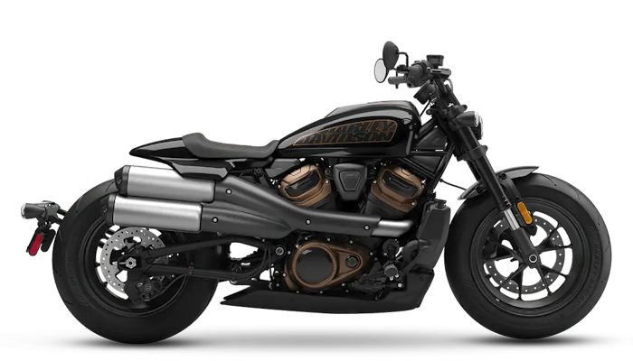
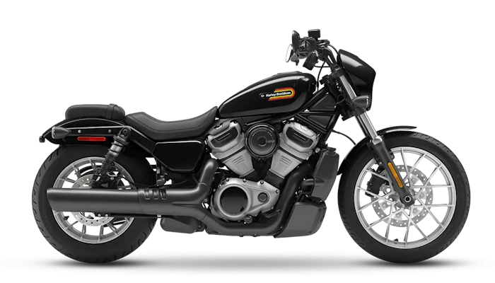
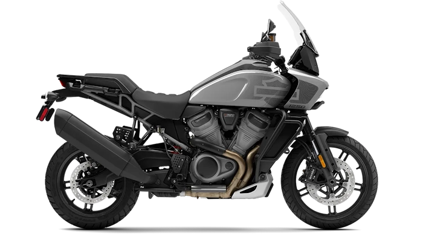

Справочник по неисправностям, обслуживанию и доработкам мотоциклов Harley-Davidson на платформе Revolution Max — [[Sportster S]], [[Nightster]] и [[Pan America]]. Здесь собран опыт владельцев: что ломается, как это распознать, как отремонтировать и какие детали подходят. Сведения сверены с сервисной документацией производителя, а там, где документация молчит, — с практикой тех, кто уже прошёл этот путь.

<a class="model-card" href="./модели/sportster-s">Sportster S</a>
<a class="model-card" href="./модели/nightster">Nightster</a>
<a class="model-card" href="./модели/pan-america">Pan America</a>

> [!tip] Telegram-группа владельцев
> Живое обсуждение, свежие вопросы и помощь в реальном времени — в Telegram-группе владельцев мотоциклов на платформе Revolution Max. Именно из её переписки выросла эта база знаний.
> Присоединяйтесь: <https://t.me/hd_sportster_s>

## Разделы

> [!tiles] Разделы
> - <svg class="tile-icon" viewBox="0 0 24 24" fill="none" stroke="currentColor" stroke-width="1.75" stroke-linecap="round" stroke-linejoin="round" aria-hidden="true"><path d='M5 16m-3 0a3 3 0 1 0 6 0a3 3 0 1 0 -6 0'/><path d='M19 16m-3 0a3 3 0 1 0 6 0a3 3 0 1 0 -6 0'/><path d='M7.5 14h5l4 -4h-10.5m1.5 4l4 -4'/><path d='M13 6h2l1.5 3l2 4'/></svg> [[Модели/index|Модели]]
> - <svg class="tile-icon" viewBox="0 0 24 24" fill="none" stroke="currentColor" stroke-width="1.75" stroke-linecap="round" stroke-linejoin="round" aria-hidden="true"><path d='M3.5 5.5l1.5 1.5l2.5 -2.5'/><path d='M3.5 11.5l1.5 1.5l2.5 -2.5'/><path d='M3.5 17.5l1.5 1.5l2.5 -2.5'/><path d='M11 6l9 0'/><path d='M11 12l9 0'/><path d='M11 18l9 0'/></svg> [[Покупка мотоцикла/index|Покупка мотоцикла]]
> - <svg class="tile-icon" viewBox="0 0 24 24" fill="none" stroke="currentColor" stroke-width="1.75" stroke-linecap="round" stroke-linejoin="round" aria-hidden="true"><path d='M7 10h3v-3l-3.5 -3.5a6 6 0 0 1 8 8l6 6a2 2 0 0 1 -3 3l-6 -6a6 6 0 0 1 -8 -8l3.5 3.5'/></svg> [[Обслуживание/index|Обслуживание]]
> - <svg class="tile-icon" viewBox="0 0 24 24" fill="none" stroke="currentColor" stroke-width="1.75" stroke-linecap="round" stroke-linejoin="round" aria-hidden="true"><path d='M4 10a2 2 0 1 0 4 0a2 2 0 0 0 -4 0'/><path d='M6 4v4'/><path d='M6 12v8'/><path d='M10 16a2 2 0 1 0 4 0a2 2 0 0 0 -4 0'/><path d='M12 4v10'/><path d='M12 18v2'/><path d='M16 7a2 2 0 1 0 4 0a2 2 0 0 0 -4 0'/><path d='M18 4v1'/><path d='M18 9v11'/></svg> [[Тюнинг/index|Тюнинг]]
> - <svg class="tile-icon" viewBox="0 0 24 24" fill="none" stroke="currentColor" stroke-width="1.75" stroke-linecap="round" stroke-linejoin="round" aria-hidden="true"><path d='M12 9v4'/><path d='M10.363 3.591l-8.106 13.534a1.914 1.914 0 0 0 1.636 2.871h16.214a1.914 1.914 0 0 0 1.636 -2.87l-8.106 -13.536a1.914 1.914 0 0 0 -3.274 0z'/><path d='M12 16h.01'/></svg> [[Неисправности/index|Неисправности]]
> - <svg class="tile-icon" viewBox="0 0 24 24" fill="none" stroke="currentColor" stroke-width="1.75" stroke-linecap="round" stroke-linejoin="round" aria-hidden="true"><path d='M6 4h-1a2 2 0 0 0 -2 2v3.5a5.5 5.5 0 0 0 11 0v-3.5a2 2 0 0 0 -2 -2h-1'/><path d='M8 15a6 6 0 1 0 12 0v-3'/><path d='M11 3v2'/><path d='M6 3v2'/><path d='M20 10m-2 0a2 2 0 1 0 4 0a2 2 0 1 0 -4 0'/></svg> [[Диагностика по симптомам|Диагностика по симптомам]]
> - <svg class="tile-icon" viewBox="0 0 24 24" fill="none" stroke="currentColor" stroke-width="1.75" stroke-linecap="round" stroke-linejoin="round" aria-hidden="true"><path d='M3 10v6'/><path d='M12 5v3'/><path d='M10 5h4'/><path d='M5 13h-2'/><path d='M6 10h2l2 -2h3.382a1 1 0 0 1 .894 .553l1.448 2.894a1 1 0 0 0 .894 .553h1.382v-2h2a1 1 0 0 1 1 1v6a1 1 0 0 1 -1 1h-2v-2h-3v2a1 1 0 0 1 -1 1h-3.465a1 1 0 0 1 -.832 -.445l-1.703 -2.555h-2v-6z'/></svg> [[Неисправности/Коды ошибок/index|Коды ошибок]]
> - <svg class="tile-icon" viewBox="0 0 24 24" fill="none" stroke="currentColor" stroke-width="1.75" stroke-linecap="round" stroke-linejoin="round" aria-hidden="true"><path d='M12 3l8 4.5l0 9l-8 4.5l-8 -4.5l0 -9l8 -4.5'/><path d='M12 12l8 -4.5'/><path d='M12 12l0 9'/><path d='M12 12l-8 -4.5'/><path d='M16 5.25l-8 4.5'/></svg> [[Запчасти и аналоги/index|Запчасти и аналоги]]
> - <svg class="tile-icon" viewBox="0 0 24 24" fill="none" stroke="currentColor" stroke-width="1.75" stroke-linecap="round" stroke-linejoin="round" aria-hidden="true"><path d='M3 19a9 9 0 0 1 9 0a9 9 0 0 1 9 0'/><path d='M3 6a9 9 0 0 1 9 0a9 9 0 0 1 9 0'/><path d='M3 6l0 13'/><path d='M12 6l0 13'/><path d='M21 6l0 13'/></svg> [[Полезная информация/index|Полезная информация]]

## Нужен ваш опыт

Не на все вопросы у нас пока есть ответы. На странице [[Нерешённые вопросы]] собраны проблемы, для которых ещё не найдено надёжного решения или не хватает данных. Если вы сталкивались с чем-то из этого списка и знаете причину, способ ремонта или просто можете поделиться наблюдениями — расскажите об этом в Telegram-группе. Каждый такой рассказ может сэкономить кому-то время, деньги и нервы.

## О проекте

Эта база знаний — не результат работы одного человека за один вечер. Она выросла из многих месяцев обсуждений в Telegram-группе владельцев: из сотен вопросов, ответов, споров, фотографий разобранных узлов, найденных каталожных номеров и честных рассказов о том, что сработало, а что — нет. Каждая страница здесь — это чья-то сломанная деталь, чей-то выходной в гараже и чья-то готовность рассказать об этом остальным.

Мы — владельцы Sportster S, Nightster и Pan America. Платформа Revolution Max появилась недавно, и вместе с её достоинствами владельцы получили и её особенности: неочевидные болезни, дефицит запчастей, отсутствие официального сервиса во многих регионах. Разбираться с этим в одиночку трудно, а вместе — намного проще. Поэтому мы делимся тем, что узнали сами, чтобы следующему владельцу не приходилось начинать с нуля, а знакомство с мотоциклом и его обслуживание приносили больше удовольствия и меньше сюрпризов.

Проект держится на энтузиазме. Это открытое сообщество, работающее на некоммерческой основе: здесь ничего не продают, не рекламируют и не берут денег за информацию. Любой владелец может задать вопрос, поделиться своим случаем или поправить неточность — база знаний становится лучше с каждым таким вкладом. Спасибо всем участникам группы, чей опыт, терпение и готовность помогать легли в основу этих страниц.

> [!warning] Важно
> Материалы этой базы знаний не являются официальной документацией производителя и не заменяют её. Советы, инструкции и рекомендации основаны на опыте владельцев и собраны из открытых источников; их работоспособность, безопасность и применимость к конкретному мотоциклу не гарантируются.
>
> Любые работы с мотоциклом вы выполняете на свой страх и риск. Если вы не уверены в своих силах или в правильности процедуры, обратитесь к квалифицированному специалисту и сверяйтесь с сервисным руководством. Особенно это касается тормозной системы, привода распредвалов и всего, что влияет на безопасность движения.
>
> Проект является неофициальным, создан сообществом владельцев и никак не связан с компанией Harley-Davidson. Названия моделей и товарные знаки принадлежат их правообладателям.
